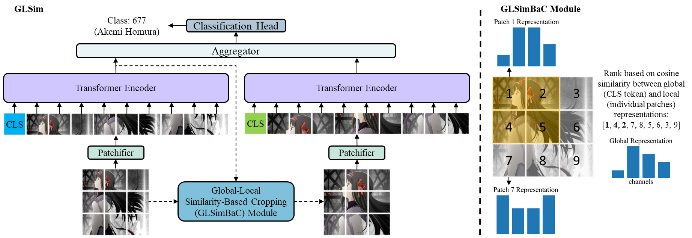
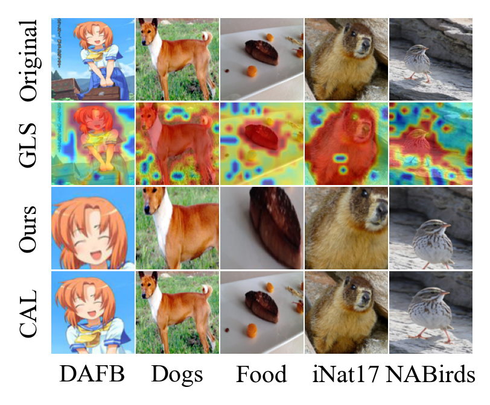

# GLSim-CUB-ViT — Classificação Fina de Espécies de Pássaros

> **Seminário de Redes Neurais Artificiais — PPGEE / UFPA**
>
> Aplicação do método **GLSim (Global-Local Similarity)** com backbone **ViT-B/16
> (224 px)** para classificação fina de **200 espécies de pássaros** do dataset
> **CUB-200-2011**.

## Resultados

Avaliação no test split (5 794 imagens, 200 classes):

| Métrica  | Valor       |
|----------|-------------|
| Top-1    | **90,85 %** |
| Top-5    | **98,34 %** |
| F1 macro | **0,908**   |

Análise completa em [`RELATORIO.md`](./RELATORIO.md) e [`relatorio.pdf`](./relatorio.pdf).

## O que o modelo faz

Dada a foto de um pássaro, o modelo prediz a espécie entre as 200 classes do
CUB-200-2011 (ex.: *Black-footed Albatross*, *Indigo Bunting*, *Painted Bunting*).

A dificuldade da tarefa é a **granularidade fina**: espécies do mesmo gênero
muitas vezes diferem apenas em detalhes locais (formato do bico, padrão das
penas, cor dos olhos). O GLSim resolve isso em duas passadas:

1. **Encoder global** — ViT-B/16 produz embeddings de patch e um token CLS.
2. **GLSCM (Global-Local Similarity Crop Module)** — calcula similaridade
   cosseno entre o token CLS e cada patch local; os patches mais similares
   delimitam uma *bounding box* discriminativa.
3. **Encoder local** — o recorte é re-encodado pelo mesmo ViT.
4. **Agregador** — os tokens CLS global e local são fundidos por um pequeno
   Transformer; a cabeça classificadora produz a predição final.



## Dataset

**CUB-200-2011** (Caltech-UCSD Birds 200):
- 200 espécies de pássaros
- 11 788 imagens
- Split: 5 994 treino · 5 794 teste

Os CSVs de splits usados estão em [`data/cub/`](./data/cub).

## Estrutura do repositório

```
GLSim-CUB-ViT/
├── glsim/                 # Pacote do modelo (ViTGLSim + utilitários)
├── tools/                 # Scripts de treino, avaliação e visualização
├── configs/               # YAMLs de configuração (dataset, método, augs)
├── data/cub/              # Splits train/val/test do CUB-200-2011
├── samples/               # Imagens de exemplo para inferência
├── assets/                # Figuras
├── infer_custom.py        # Inferência sobre uma pasta de imagens de pássaros
├── eval_test.py           # Avaliação completa no test split
├── analyze_similarity.py  # Estudo da métrica GLS
├── dashboard.py           # Monitor de treinamento (terminal)
├── RELATORIO.md           # Relatório técnico em Markdown
└── relatorio.pdf          # Relatório técnico em PDF
```

## Setup

Requer Python 3.10+ e PyTorch com CUDA. Instalação:

```
pip install -e .
```

> O checkpoint treinado (≈ 710 MB) não é versionado — está acima do limite do
> GitHub. Para reproduzir o modelo, siga a seção [Treinamento](#treinamento).

## Treinamento

Treinar `GLSim-ViT-B/16` no CUB-200-2011 com imagens 224 × 224:

```
python tools/train.py \
    --cfg configs/cub_ft_is224_medaugs.yaml \
    --lr 0.01 \
    --model_name vit_b16 \
    --cfg_method configs/methods/glsim.yaml
```

Durante o treino, o log é gravado em `training_log.txt`. Para acompanhar em
tempo real num terminal separado:

```
python dashboard.py
```

A curva de treinamento gerada está em `training_curves.png`.

## Avaliação

Avaliar um checkpoint no test split:

```
python tools/train.py --ckpt_path ckpts/cub_glsim_224.pth --test_only
```

Script de avaliação detalhada (gera matriz de confusão, F1 por classe,
top-K, etc. em `eval_test_output/`):

```
python eval_test.py
```

Para visualizar as imagens em que o modelo erra:

```
python tools/train.py --ckpt_path ckpts/cub_glsim_224.pth --vis_errors_save
```

## Inferência em fotos de pássaros

Classificar uma única imagem de pássaro (resultado é salvo em
`results_inference/`):

```
python infer_custom.py --images_path minhas_fotos/passaro.jpg --top_k 5
```

Classificar uma pasta inteira de fotos:

```
python infer_custom.py --images_path minhas_fotos/ --top_k 5
```

Visualizar o **mecanismo de seleção discriminativa** (mapa GLS sobre a
imagem, mostrando onde o modelo "olhou"):

```
python tools/inference.py \
    --ckpt_path ckpts/cub_glsim_224.pth \
    --images_path samples/ \
    --vis_mask glsim_norm --vis_mask_sq
```

Exemplos de recortes selecionados pelo GLSCM em pássaros do CUB:



## Uso como módulo

```python
import torch
from glsim.model_utils import ViTGLSim, ViTConfig

cfg = ViTConfig(
    'vit_b16',
    classifier='cls',
    dynamic_anchor=True,
    reducer='cls',
    aggregator=True,
    aggregator_norm=True,
    aggregator_num_hidden_layers=1,
)
model = ViTGLSim(cfg)

x = torch.rand(2, cfg.num_channels, cfg.image_size, cfg.image_size)
preds = model(x)   # logits sobre as 200 classes do CUB
```

## Citação

Método original:

```bibtex
@misc{rios_global-local_2024,
    title  = {Global-Local Similarity for Efficient Fine-Grained Image
              Recognition with Vision Transformers},
    url    = {http://arxiv.org/abs/2407.12891},
    author = {Rios, Edwin Arkel and Hu, Min-Chun and Lai, Bo-Cheng},
    year   = {2024},
    note   = {arXiv:2407.12891 [cs]},
}
```

Dataset:

```bibtex
@techreport{WahCUB_200_2011,
    title       = {The Caltech-UCSD Birds-200-2011 Dataset},
    author      = {Wah, C. and Branson, S. and Welinder, P. and Perona, P.
                   and Belongie, S.},
    institution = {California Institute of Technology},
    number      = {CNS-TR-2011-001},
    year        = {2011},
}
```
